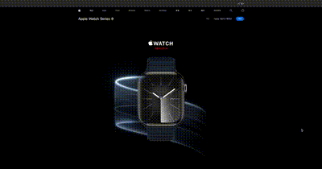
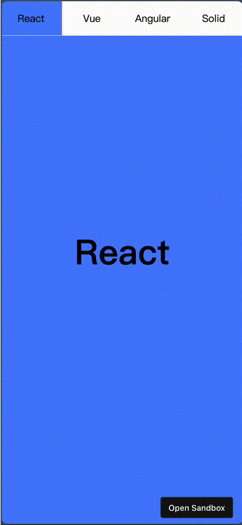

**animation-timeline 是一个 CSS 属性，用来设置一个时间轴，控制动画的进度。它提供了两个有用的 function，分别是**

- scroll: 计算当前元素的某个祖先滚动容器，提供一个滚动时间轴
- view: 计算当前元素的可见性比例，作为一个时间轴，有点像 InterSectionObserver。

```css
/* Single animation anonymous scroll progress timeline */
animation-timeline: scroll();
animation-timeline: scroll(scroller axis);

/* Single animation anonymous view progress timeline */
animation-timeline: view();
animation-timeline: view(axis inset);
```

结合滚动容器的滚动比例及元素的可见比例，可以做出类似苹果官网动画。



```html
<!DOCTYPE html>
<html lang="en">
  <head>
    <meta charset="UTF-8" />
    <meta name="viewport" content="width=device-width, initial-scale=1.0" />
    <meta http-equiv="X-UA-Compatible" content="ie=edge" />
    <title>HTML + CSS</title>
    <link rel="stylesheet" href="styles.css" />
    <style>
      * {
        margin: 0;
      }
      :root {
        width: 100vw;
        height: 100vh;
        scroll-snap-type: y mandatory;
        scroll-behavior: smooth;
        --color-1: #4b7eff;
        --color-2: #ff6464;
        --color-3: #ffd966;
        --color-4: #42b883;
        --color-5: #8e67cd;
      }
      nav {
        position: fixed;
        width: 100vw;
        z-index: 10;
        top: 0;
        left: 0;
        background-color: white;
        display: flex;
      }
      nav > a {
        flex: 1;
        text-align: center;
        padding: 16px;
        text-decoration: none;
        color: black;
      }
      nav::before {
        content: "";
        position: absolute;
        top: 0;
        right: 0;
        bottom: 0;
        left: 0;
        z-index: -1;
        background: linear-gradient(
          90deg,
          var(--color-1) 0 25vw,
          var(--color-2) 0 50vw,
          var(--color-3) 0 75vw,
          var(--color-4) 0 100vw
        );
        animation-timeline: scroll(root);
        animation-name: progress;
        animation-timing-function: linear;
        animation-duration: 1ms;
        animation-fill-mode: both;
      }
      .page {
        width: 100vw;
        height: 100vh;
        scroll-snap-align: center;
        display: flex;
        justify-content: center;
        align-items: center;
        font-size: 4rem;
        font-weight: bold;
        view-timeline-name: --page-view;
        view-timeline-inset: 50% -10%;
      }
      .page:nth-of-type(1) {
        background-color: var(--color-1);
      }
      .page:nth-of-type(2) {
        background-color: var(--color-2);
      }
      .page:nth-of-type(3) {
        background-color: var(--color-3);
      }
      .page:nth-of-type(4) {
        background-color: var(--color-4);
      }
      .page > span {
        animation-timeline: --page-view;
        animation-name: appear;
        animation-timing-function: ease;
        animation-duration: 1ms;
        animation-fill-mode: both;
      }
      @keyframes appear {
        from {
          opacity: 0;
          transform: scale3d(0.1, 0.1, 0.1) translate3d(0, 1000px, 0);
          animation-timing-function: cubic-bezier(0.55, 0.055, 0.675, 0.19);
        }

        60% {
          opacity: 1;
          transform: scale3d(0.475, 0.475, 0.475) translate3d(0, -60px, 0);
          animation-timing-function: cubic-bezier(0.175, 0.885, 0.32, 1);
        }
      }
      @keyframes progress {
        0% {
          width: 25vw;
        }
        100% {
          width: 100vw;
        }
      }
    </style>
  </head>
  <body>
    <div id="react" class="page"><span>React</span></div>
    <div id="vue" class="page"><span>Vue</span></div>
    <div id="angular" class="page"><span>Angular</span></div>
    <div id="solid" class="page"><span>Solid</span></div>
    <nav>
      <a href="#react">React</a>
      <a href="#vue">Vue</a>
      <a href="#angular">Angular</a>
      <a href="#solid">Solid</a>
    </nav>
  </body>
</html>
```

最终效果

https://m3m55n.csb.app/



首先，顶部导航栏利用 `animation-timeline: scroll(root)`将动画的时间轴绑定为根元素的滚动（这也是定义和使用一个匿名时间轴），动画效果是将`width`从 25vw 变为 100vw，同时导航栏背景是使用渐变色的特殊效果达到；还使用hash路由实现点击滚动到对应页面。

其次，每一页都使用了`scroll-snap-align: center`实现整页滚动对齐的效果。

最后，对page类中定义一个具名的动画时间轴，绑定为page类的可见性程度。

```css
.page {
	view-timeline-name: --page-view;
	view-timeline-inset: 50% -10%;
}
```

对page的内容文字都使用`animation-timeline: --page-view`将动画时间轴设置为上面设置的具名时间轴，从而实现滚动到当前页面时，文字动画出现。