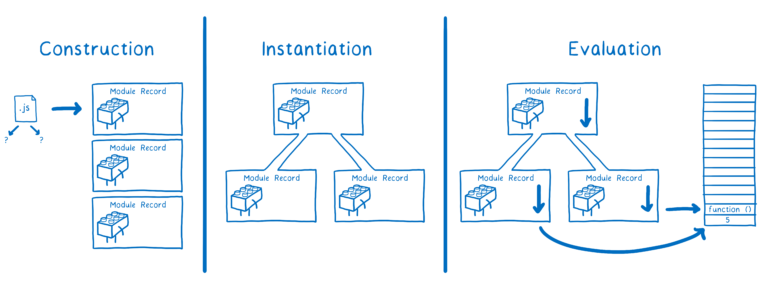

# 目录
# 上古时期

## No-Modules

没有模块化的概念，所有变量/函数都在全局定义中。

```jsx
function xxx() {
	// ...
}
function yyy() {
	// ...
}
```

由此带来的问题就是：

- Global被“污染”
- 命名冲突

## NameSpace Pattern

引入了命名空间的概念/模式

```jsx
var MyNS = {
	xxx: function(){},
	yyy: function(){}
}
```

然而，这种模式并不能完全解决前面(No-Modules)的问题，即使它减少了Global上变量的数量，依然无法避免命名冲突。

此外，这种模式的本质上是对象，所以不安全。

> 安全指内部属性的访问权限，例如私有变量
> 

## IIFE Pattern

> immediately invoked function expression
> 

```jsx
var Module = (function() {
	var _private = "safe now";
  var foo = function(){
      console.log(_private)
  }

  return {
     foo
  }
})();

Module.foo();
Module._private; // undefined
```

到这里，封装的概念已经实现了，并且很好地解决了全局污染、命名冲突及安全性问题。

更进一步，需要考虑的是 ***引入依赖*** 的问题。

## Module Pattern

```jsx
var jQuery = (function(){...})()
var Module = (function($){
    var _$body = $("body");     // we can use jQuery now!
    var foo = function(){
        console.log(_$body);    // 特权方法
    }
    return {
        foo
    }
})(jQuery)

Module.foo();
```

在基础的IIFE模式下，将依赖声明并传入。***这就是现代模块实现的基石。***

# CommonJS

> 横空出世
> 

可以看到大部分模式都有的共同点：**使用一个特定的全局模块名来把一些私有变量和方法包起来，然后通过闭包来创建一个私有的命名空间。**

仍然存在的问题：

1. 模块的依赖管理
2. 全局命名冲突依然存在，以及同一模块的不同版本的冲突

CommonJS规范：

- 每个 JS 文件是一个独立的 module context，创建的变量默认都是私有的。
- 通过 module.exports 来向其他 module 显露接口
- 通过 require 来引入其他 module

> module 和 require 都是 CommonJS 规范中预告定义好的对象，和 global 一样。在你的代码传递给 JS 引擎前，NodeJS会用下面的辅助函数包裹你的代码。
> 

```jsx
(function (exports, require, module, __filename, __dirname) {
    // ...
    // Your code injects here!
    // ...
});
```

该规范的优势：

- require 进来的模块可以被赋值到自己随意定义的局部变量中，避免命名冲突和版本冲突
- module 间的依赖关系清晰

值得注意的是， CommonJS 是为了服务端场景而产生的规范，所以采用的是***同步加载策略***。

> 采用同步加裁策略是因为服务端模块主要加载来源硬盘、内存，这些IO操作的速度较快。
但是考虑在浏览器环境，如果依然使用同步加载策略，那么由于从网络中加载模块的速度较慢，会使浏览器挂起。
> 

# AMD

> Asynchronous(eɪˈsɪŋkrənəs) Module Definition，异步模块定义
> 

```jsx
// index.js
define(['myModule', 'myOtherModule'], function(myModule, myOtherModule) {
  console.log(myModule.hello());
});

// mmyModule.js
define([], function() {
  return {
    hello: function() {
      console.log('hello');
    },
    goodbye: function() {
      console.log('goodbye');
    }
  };
});
```

使用 define 这个预设函数来进行模块的定义与引用

- 第一个参数列出了本模块所依赖的模块id
- 第二个参数是一个回调函数，会在依赖全部加载完成后被调用，需要在该回调函数中实现本模块

# UMD

> Universal Module Definition
> 

使模块兼容 AMD 和 CommonJS，使用一个辅助函数来包裹和判断

```jsx
(function (root, factory) {
  if (typeof define === 'function' && define.amd) {
      // AMD
    define(['myModule', 'myOtherModule'], factory);
  } else if (typeof exports === 'object') {
      // CommonJS
    module.exports = factory(require('myModule'), require('myOtherModule'));
  } else {
    // Browser globals (Note: root is window)
    root.returnExports = factory(root.myModule, root.myOtherModule);
  }
}(this, function () {...});
```

# ES Module

> ES2015加入的，官方设计的模块管理。
> 

加入 keyword: import export 来实现。

```jsx
import { fn } from 'foo';
export const a = () => {
  fn();
};
```

ES Module 系统中，从入口文件开始构建一个依赖图，然后执行下面三个步骤。

1. Construction构建： 搜寻、下载和解析所有的文件为 module records，并且置于 module map中。
2. Instantiation实例化：在内存中为 export 出的变量寻找空间，然后使所有的 exports 和 imports ***指向相应的内存空间***（这称为linking）
3. Evaluation执行：执行代码，使上述内存空间得到真正的值

在 ES Module 中，这三个步骤是可以分开执行的，所以有以下特性：异步加载和循环依赖



> 注意 exports 和 imports 使用 live binding 指向了相同的内存空间，这保证了 exports 值变更时，imports 能得到相应的变更
> 

> 参考：
https://huangxuan.me/js-module-7day/#/
https://github.com/myshov/history-of-javascript/tree/master/4_evolution_of_js_modularity
https://yuguo.us/weblog/javascript-module-development-history/
https://hacks.mozilla.org/2018/03/es-modules-a-cartoon-deep-dive/
> 

# 附加阅读

# 昔日王者YUI3

## 基于模块的依赖管理

```jsx
// 声明要使用 dom 模块
YUI.use('hello', function(Y){ // 获得 Y 实例
	Y.HELLO.xxx(); // 使用声明的模块（已经初始化完了
})

// 定义模块&初始化
YUI.add('hello', function(Y) {
  // 初始化
	Y.HELLO = {
		xxx: function() {
			// 使用其他模块
			Y.DOM.xxx(...);
		}
	}
}, '3.0.0', {
	// 依赖其他模块
	requires: ['dom']
})
```

## 沙箱隔离

YUI使用的Y参数其实是一个沙箱实例，所有依赖模块会通过attach的方式流入到沙箱。

> attach: 在当前 YUI 实例上执行模块的初始化代码，使得模块在当前实例上可用
>