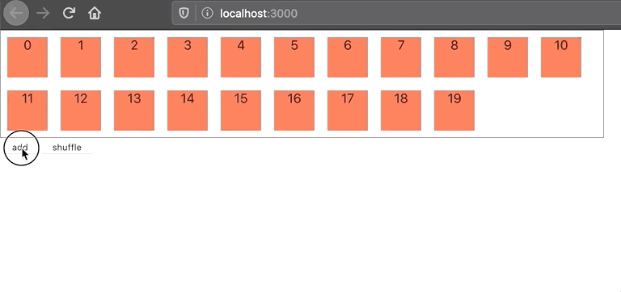

# 目录

> 💡 本文将叙述如何使用FLIP技术，React Hooks和Web Animation API来实现丝滑的动画


# 一个需求

思考一个需求：有一个flex-box，当我们向flex-box中添加元素时，原有的元素会进行重新排序（取决于新元素插入何处），我们希望元素的位置变换有动画进行支撑。

# 什么是FLIP

对于上面的需求，一般来说实现思路是这样的：计算元素重新排序后所在的位置，然后用切换样式类等方法使元素通过动画移动到相应位置。而最复杂的地方在于如何计算元素的新位置，特别是当元素大小不一时。

但是，为什么不可以把这些复杂的计算交给浏览器呢？因为我们知道，像React等数据驱动型的前端库，数据模型的重新排序后，真实DOM元素会重排，浏览器会自动计算出重排后相应的元素位置。

`FLIP`是就是这么一项神奇的动画技术，它的思路是将重新排序后的元素插入DOM树，直接获取浏览器计算好的位置，而开发者只需要在起始位置之间进行动画定义，这就避免了开发者进行复杂的计算。`FLIP`是一个缩写，它们分别是：

- **F**irst：元素在变换前的初始状态
- **L**ast：元素在变换后的最终状态
- **I**nvert：反转变换，这里的反转是相对于最终状态（因为元素已经被插入DOM，处于最终状态）来说的。举个例子，元素位移了100px到达最终位置，那么需要设置元素的变换是从`0%{transform: translateX(-100px)}`到`100%{transform: translateX(0)}` ，从而使得元素能从原始状态变换到最终状态。
- **P**lay：应用变换，可以使用切换样式类来实现，也可以使用Web Animation API来实现。

# 实现

先使用一个flex-box作为容器，Item组件简单返回<div>，原始数据长度为20。以及实现一个add按钮和shuffle按钮，分别用来增加数据和打乱数据。

```jsx
// Item组件
const Item = ({ value }) => {
  return (
    <div
      style={{
        width: 50,
        height: 50,
        textAlign: "center",
        background: "tomato",
        margin: 8,
      }}
    >
      {value}
    </div>
  );
};
function App() {
  const [items, setItems] = useState(() =>
    Array(20)
      .fill("")
      .map((_, index) => index)
  );
  return (
    <div>
      <div
        style={{
          display: "flex",
          flexWrap: "wrap",
          width: "70%",
          border: "1px gray solid",
          overflow: "hidden",
        }}
      >
        {items.map((item, index) => (
          <Item
            key={item}
            value={item}
          />
        ))}
      </div>
			<button
        onClick={() => {
          setItems((preItems) => {
            const added = Array(5)
              .fill(0)
              .map(() => Math.random().toString(32).slice(-4));
            return [...added， ...preItems];
          });
        }}
      >
        add
      </button>
      <button
        onClick={debounce(() => {
          setItems((prev) => shuffle(prev));
        }, TIME)}
      >
        shuffle
      </button>
    </div>
  );
}
```

这时我们添加数据，不会看到有任何动画效果，只是简单的重绘一闪而过。



为了实现元素位移的路径动画，我们可以使用一个自定义hook来编写逻辑。这里命名为`useFLIP`，代码如下：

```jsx
/**
 * 路径动画
 * 使用FLIP技术实现
 * @param {React.MutableRefObject<HTMLElement>} ref
 * @param {{
 * duration?: Number,
 * }} [options]
 */
const useFLIP = (
  ref,
  { duration = 300 } = {}
) => {
  const [position, setPosition] = useState({ left: 0, top: 0 });

  useEffect(() => {
    const { left, top } = ref.current.getBoundingClientRect();
    setPosition({ left, top });
  }, []);

  useLayoutEffect(() => {
    if (!ref.current) return;
    const { left, top } = ref.current.getBoundingClientRect();
    const { left: prevLeft, top: prevTop } = position;
		// 计算反转
    const invert = {
      left: prevLeft - left,
      top: prevTop - top,
    };
    if (invert.left === 0 && invert.top === 0) return;

		// 定义关键帧
    let keyframes = [
      {
        transform: `translate(${invert.left}px, ${invert.top}px)`,
      },
      {
        transform: "translate(0, 0)",
      },
    ];
		// 使用Web Animation API对元素应用动画效果
    const animation = ref.current.animate(keyframes, {
      duration,
      easing: "cubic-bezier(0,0,0.32,1)",
    });
    animation.onfinish = () => {
      setPosition({ left, top });
    };
    return () => {
      if (!animation.finished) {
        animation.cancel();
      }
    };
  });
};
```

`useFLIP`可以分为三个部分

1. 设置`position`状态变量，用来保存元素的当前位置。
2. 初始化`position`状态的effect，使用`getBoundingClientRect` 方法。
3. 每次位置变化时重新进行位置获取和动画效果应用的layoutEffect。此处是`useFLIP`的核心部分。根据FLIP的思路得到以下逻辑：
    - F：通过`position`状态变量获取此次变换的初始状态。
    - L：在`useLayoutEffect`（关于useLayoutEffect的执行时机：见[React官网文档](https://zh-hans.reactjs.org/docs/hooks-reference.html#uselayouteffect)）中进行的副作用，是在DMO变更之后，浏览器执行绘制之前，并且会阻塞绘制，所以特别合适FLIP中获取Last最终状态（即此时浏览器已经计算出元素新位置，却又还未绘制到页面上）。这里使用`getBoundingClientRect` 方法就可以获得此次变换元素的最终状态。
    - I：计算初始状态和最终状态的位置偏差，并定义动画的关键帧。关键帧动画的0%和100%状态要注意反转，以最终状态作为基准进行定义。
    
    ```jsx
    let keyframes = [
          {
            transform: `translate(${invert.left}px, ${invert.top}px)`,
          },
          {
            transform: "translate(0, 0)",
          },
        ];
    ```
    
    - P：使用Web Animation API应用动画效果。

完成`useFLIP` 这个hook后，就可以在Item组件中使用它。

```jsx
const Item = ({ value }) => {
  const ref = useRef();
  useFLIP(ref, {
    duration: 300,
  });
  return (
    <div
      ref={ref}
  ... ...
};
```

最终效果如下：


# 总结

FLIP巧妙地将元素新位置的计算这种复杂任务交给浏览器，并且通过反转变换的方式使得元素的动画能够遵循正常的时序。开发者只要知道初始状态和最终状态，就能实现优秀的路径动画，这种数据驱动的思想和符合了当前诸如React等的前端库的思想。相信，该技术在许多其他需求上都能大放光彩，例如列表重排、Drag-And-Drop、红包发送动画等等。

# 参考文章

1. [flip-your-animation](https://aerotwist.com/blog/flip-your-animations/) 
2. [掘金文章](https://juejin.im/post/5ed72e6f6fb9a04801705e39)