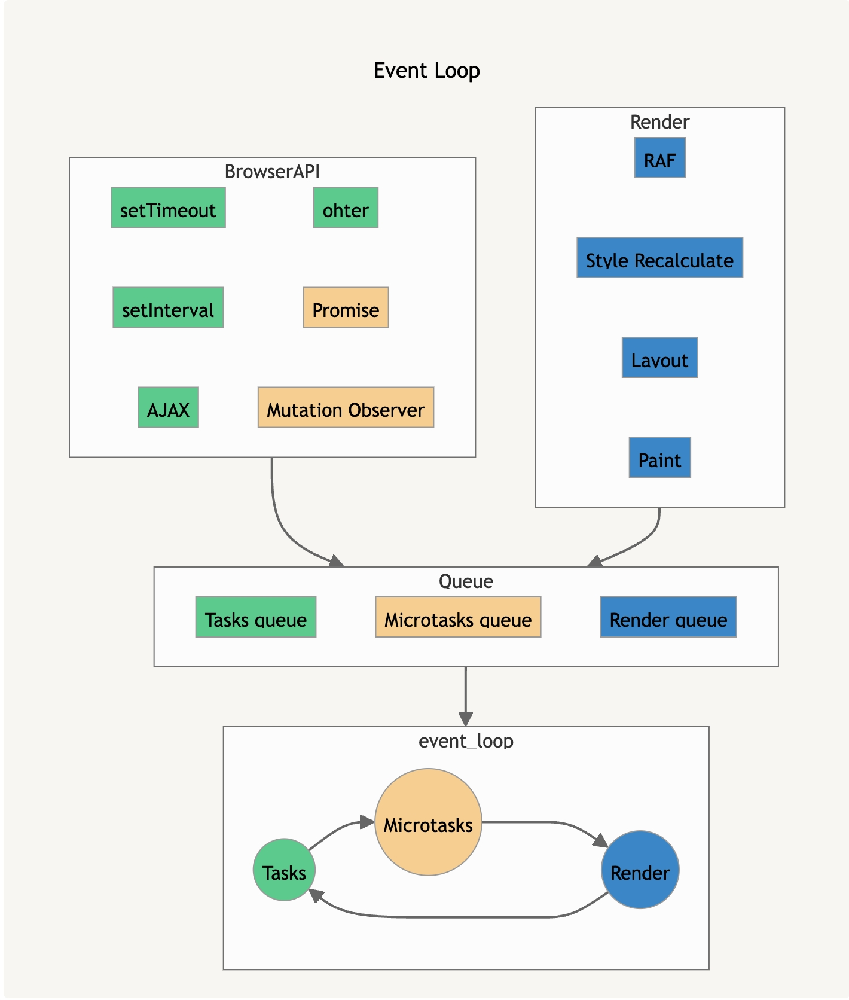

---
title: '浏览器中的事件循环'
tags: ['js', 'browser']
slug: event-loop-in-browser
--- 

> 浏览器中的事件循环
> 

在浏览器中，一个 tab 页占用一个进程，并且只有一个 Main Thread。main thread 负责页面的渲染、JS 的执行、用户的行为交互等；但是 main thread 只是一个单一线程，如何处理这么多任务呢？这边需要引入 event loop 的概念。

# Task 如何产生

我们可以将浏览器需要做的事情分成三类：Tasks, Microtasks 和 Render，从上面的图我们可以看到各种任务的来源：

- **Tasks**: setTimeout 的调用，AJAX 等，也包括对 JS 脚本的运行本身也是一个 task
- **Microtasks**: Promise.then 回调等
- **Render**: RAF 回调，以及其他浏览器组织的渲染任务（样式计算，排版，绘制）

# Loop 如何运行

Event Loop 的流程如下：

1. 从 Tasks Queue 中取出一个任务，开始执行
    1. 执行过程中会产生其他任务，会放入不同的 queue
2. 遍历 Microtasks Queue 所有的任务
    1. 可能产生新的 microtasks
    2. 要保证 microtasks queue 为空
3. 遍历 Render Queue 所有的任务
    1. RAF 注册的回调在这里最先执行
4. 回到 1